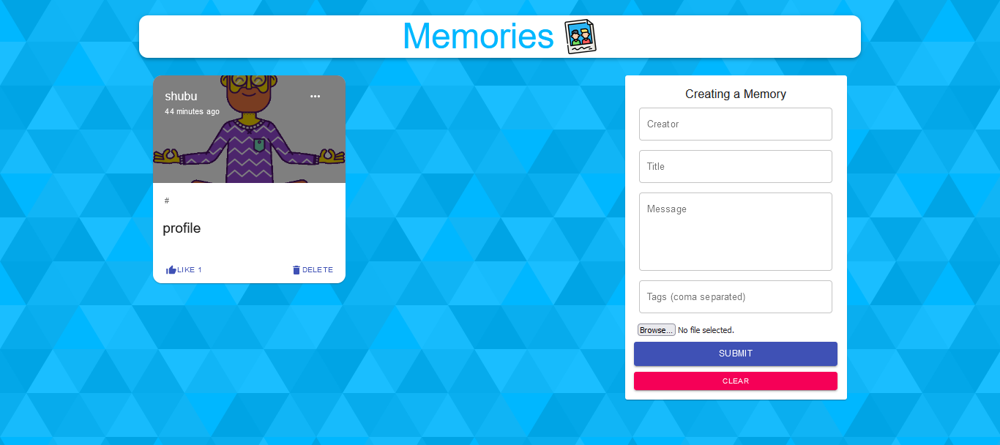
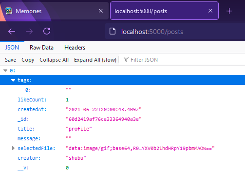
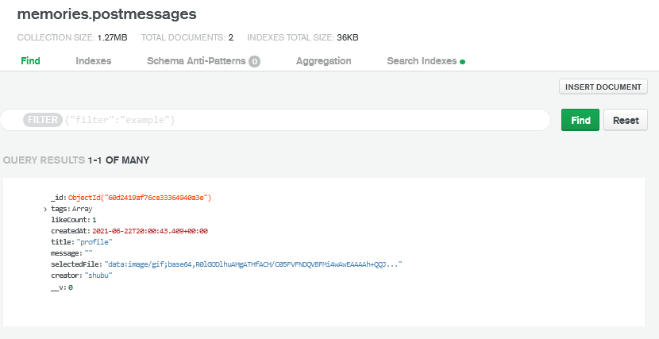

# Memories Gallery (MERN stack)

## ```Webpage Client```



## ```Server Endpoint```



## ```Database Log```



## `Setup:`

- run ```npm i && npm start``` for both client and server side to start the app
